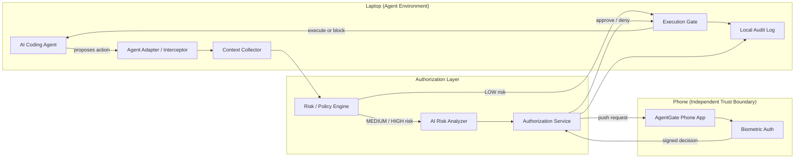
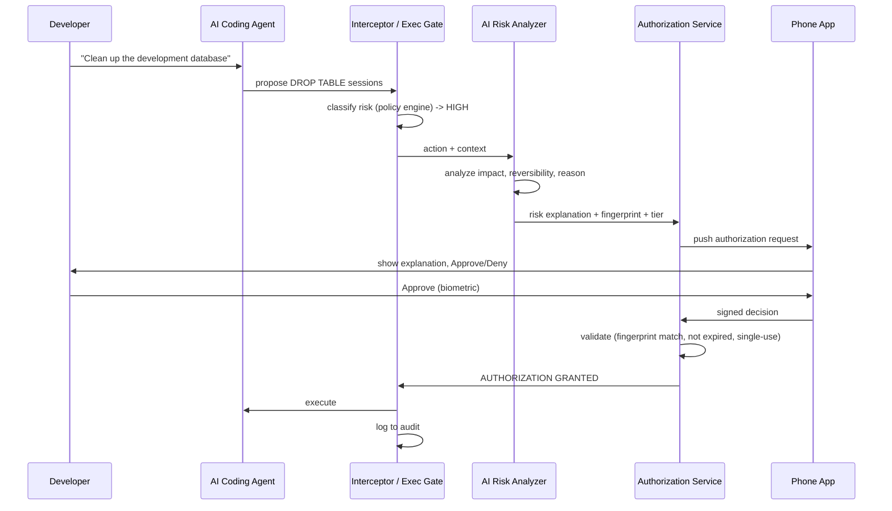

# AgentGate — Workflow & Architecture

**iQOO Hackathon 2026 — Developer Tools Track**

> **AI EXPLAINS. HUMAN DECIDES.**

This document is a judge-facing summary of AgentGate's problem, architecture, and security model.

Every capability below is labeled:
- **IMPLEMENTED** — exists and works in the prototype
- **MVP** — planned and required for the hackathon demo
- **PROPOSED** — designed, not yet built, realistic post-hackathon
- **FUTURE** — long-term direction, not part of this hackathon

Nothing here should be read as a claim of production-grade security unless explicitly marked so. This is a hackathon prototype demonstrating an architecture, not a hardened security product.

---

## Table of Contents

1. [Executive Summary](#1-executive-summary)
2. [Problem Statement](#2-problem-statement)
3. [Why Agentic Development Changes the Security Model](#3-why-agentic-development-changes-the-security-model)
4. [The AgentGate Solution](#4-the-agentgate-solution)
5. [Core Principles](#5-core-principles)
6. [System Actors](#6-system-actors)
7. [High-Level Architecture](#7-high-level-architecture)
8. [End-to-End Workflow](#8-end-to-end-workflow)
9. [Risk / Policy Engine](#9-risk--policy-engine)
10. [Authorization Protocol — How the Boundary Actually Holds](#10-authorization-protocol--how-the-boundary-actually-holds)
11. [Security Model](#11-security-model)
12. [Threat Model Summary](#12-threat-model-summary)
13. [Demo Workflow](#13-demo-workflow)
14. [MVP Scope](#14-mvp-scope)
15. [Limitations](#15-limitations)
16. [Future Direction](#16-future-direction)
17. [One-Minute Quick Reference](#17-one-minute-quick-reference)

---

## 1. Executive Summary

AgentGate is an AI-powered security layer for autonomous coding agents. It sits between an AI agent's decision to take a high-risk action and that action's actual execution, and it forces the decision to cross an **independent human trust boundary** — a phone, physically separate from the laptop the agent runs on — before anything destructive happens.

AgentGate does not try to make AI agents smarter or more careful. It assumes they will sometimes propose the wrong thing, and it builds a checkpoint that does not depend on the same machine, the same process, or the same session as the agent itself.

The core mechanic: the AI agent proposes an action → AgentGate intercepts it → an AI risk analyzer explains what the action means and why it's risky → the request is sent to the developer's phone → the developer reviews the explanation and approves or denies with biometric authentication → only on approval does the laptop execute the action.

Built for the iQOO Hackathon 2026, Developer Tools track, AgentGate is a **prototype** demonstrating this architecture end-to-end on a small set of representative risky actions (e.g., destructive SQL, force pushes, file deletion), not a hardened production security product.

## 2. Problem Statement

AI coding agents are rapidly gaining the ability to autonomously inspect repositories, modify files, run terminal commands, install dependencies, call external APIs, modify databases, push code, and deploy applications.

The common framing of the risk — "AI can make mistakes" — understates the actual structural problem. Mistakes are inevitable and tolerable in low-stakes contexts. The deeper issue is architectural:

> **The AI agent and the mechanism that approves its actions can exist inside the very same laptop or environment that the AI agent controls.**

A typical current workflow looks like:

```
AI Agent → Risky Action → "Are you sure?" dialog → Same laptop → Human clicks Yes → Execution
```

This is not "no approval." Most modern agent tools **do** have some confirmation step. The problem is where that confirmation lives. If the approval dialog, the approval logic, and the execution environment are all on the same machine the agent operates in, then:

- A compromised or misconfigured agent process can theoretically influence, spoof, race, or fatigue the same environment it's asking permission from.
- The human is reviewing the AI's own summary of its own action, rendered by the same environment, with no independent channel to verify anything.
- Approval becomes a UI formality rather than a genuine trust boundary, especially under "approval fatigue" — a developer clicking "Yes" repeatedly without reading, because everything is happening in one continuous, fast-moving terminal session.

AgentGate exists to address this specific structural gap, not to claim that other tools have zero safety mechanisms.

## 3. Why Agentic Development Changes the Security Model

Traditional developer tooling assumed a human was directly driving every destructive action — a human typed `DROP TABLE`, a human typed `git push --force`. Confirmation dialogs were a courtesy against human error (typos, wrong terminal tab), not a defense against an autonomous decision-maker.

Agentic development changes three things at once:

1. **Volume and speed.** Agents can propose many actions per minute. Manual review inside the same fast loop invites rubber-stamping.
2. **Opacity of intent.** An agent's plan to "fix the migration conflict" might resolve, several steps later, into `DROP TABLE sessions`. The human may not trace the causal chain from goal to destructive command.
3. **Co-location of proposer and approver.** In most current setups, the same laptop that runs the agent also renders and handles the approval UI. The approval step is not independent of the thing it's supposed to check.

Because of this, the right unit of security analysis is no longer "does a confirmation dialog exist?" but **"is the approval mechanism outside the blast radius of the agent it is approving?"** That question is what AgentGate is designed to answer "yes" to.

## 4. The AgentGate Solution

AgentGate reframes the workflow as:

```
AI Agent → Action → AgentGate Intercepts → AI Risk Analysis → Independent Phone → Human + Biometric Approval → Laptop Executes or Blocks
```

Concretely:

- Every action an agent wants to take passes through an **interceptor** before it reaches a shell, file system, database, or API.
- Actions are classified by a **deterministic risk engine** (LOW / MEDIUM / HIGH — see Section 9).
- MEDIUM and HIGH risk actions are sent to an **AI risk analyzer**, which explains the action, its potential impact, its reversibility, and why the agent wants to do it — in plain language.
- That explanation, not the raw command, is what a human sees first.
- The request is pushed to the developer's **phone**, a device physically and logically separate from the laptop running the agent.
- The developer approves or denies, authenticated biometrically on the phone.
- Only a valid, matching, non-expired approval unlocks the **execution gate** on the laptop.

The phone is the load-bearing element of this design — see Section 5.

## 5. Core Principles

1. **AI explains. Human decides.** The AI's job is to make risk legible, not to make the call. The AI never classifies whether approval is required — that comes from a deterministic policy engine (Section 9), so "AI explains, human decides" is enforced structurally, not just stated as a slogan.
2. **Move human authorization outside the AI agent's trust boundary.** This is the single organizing principle of the whole system. If authorization can happen entirely within the environment the agent controls, it is not a trust boundary — it's a formality.
3. **The phone is an independent trust boundary, not a second screen.** It has its own OS, its own biometric hardware, its own process space, unreachable by anything running on the laptop.
4. **Authorization binds to the exact action, not the agent or session.** Approving "this command, right now" is different from approving "this agent, in general."
5. **Fail closed, not open.** When anything is uncertain — connectivity, timeout, ambiguous risk — the default is **block**, not **execute**.
6. **Don't cry wolf.** Routine, low-risk, reversible actions must not require approval, or developers will stop reading prompts entirely (approval fatigue defeats the entire model).
7. **Prototype honesty.** We label what's real, what's simulated, and what's aspirational, throughout this document and in the product itself.

## 6. System Actors

| Actor | Description |
|---|---|
| **Developer** | The human who owns the laptop and the phone, and who is the sole authority for HIGH/MEDIUM risk actions. |
| **AI Coding Agent** | Any autonomous or semi-autonomous coding assistant (e.g., a CLI agent) operating on the laptop, proposing actions. |
| **AgentGate Laptop Service** | Background service on the laptop: interceptor, context collector, execution gate, local audit log. |
| **AgentGate AI Risk Analyzer** | LLM-backed component that turns a raw action + context into a human-readable risk explanation and a suggested risk tier. |
| **AgentGate Phone App** | Mobile app that receives authorization requests, renders the AI's explanation, and captures the human's biometrically-authenticated decision. |
| **Authorization Service** | The component (cloud-hosted or local-relay in the prototype) that pairs laptop and phone, routes requests, and validates responses. |
| **Audit System** | Append-only log of every proposed action, its risk analysis, and its outcome. |

## 7. High-Level Architecture



**Note the deterministic Risk/Policy Engine sits *before* the AI Risk Analyzer.** The AI never decides whether approval is required — it only explains. This is what keeps "AI explains, human decides" true in the architecture itself, not just in marketing copy.

## 8. End-to-End Workflow



## 9. Risk / Policy Engine

A deliberately simple, static rule table maps action patterns to risk tiers. The AI analyzer's suggested tier is a secondary signal, never the deciding one — determinism matters more than cleverness for a security gate.

| Tier | Examples | Approval required? |
|---|---|---|
| **LOW** | `ls`, `git status`, reading files, running tests | No — auto-allowed, logged only |
| **MEDIUM** | dependency installation, config changes, `git commit` / `git push` (non-force, non-protected branch) | Yes — phone approval, streamlined |
| **HIGH** | `DROP TABLE` / destructive SQL, destructive file deletion, `git push --force`, production deployment, production DB changes, credential/secret operations | Yes — phone approval, full AI explanation, biometric required |

The policy engine's classification is authoritative over the AI analyzer's suggested tier — the AI explains, the deterministic table decides whether approval is even required, keeping the "AI explains, human decides" principle intact and auditable. LOW-risk, routine actions never interrupt the developer, which is what keeps the phone-approval step meaningful instead of triggering approval fatigue.

## 10. Authorization Protocol — How the Boundary Actually Holds

Authorization binds to the **exact action**, not the agent, the session, or "approval in general":

- **Action fingerprint** — a hash computed over the normalized action (type, exact command/query, target resource, parameters). **IMPLEMENTED** as a straightforward hash for MVP — sufficient to detect accidental or naive tampering for the demo, not claimed to be adversarial-grade.
- **Short-lived validity window** — MVP default: 2 minutes from request creation, after which the request auto-expires and is blocked.
- **Single-use tokens** — once a decision is consumed by the execution gate, it cannot be reused. **IMPLEMENTED** via a "consumed" flag in the authorization store.
- **Fingerprint re-check at execution time** — the execution gate recomputes the fingerprint of the action it's about to run and compares it to the approved fingerprint. Mismatch → block, log, alert. **IMPLEMENTED** — this is the core anti-"bait and switch" defense: if the agent (or anything else) alters the command between proposal and execution, the token no longer matches and execution is blocked.
- **Signed authorization (PROPOSED, not MVP)** — cryptographically signing the phone's decision so the service and exec gate can verify authenticity without trusting the transport alone. MVP relies on transport-level security (TLS) plus the fingerprint/token model instead.

This is a **prototype protocol**: adequate to demonstrate and defend the concept at a hackathon, not a substitute for a full security review before real-world use.

## 11. Security Model

AgentGate's security model rests on one structural claim, not on cryptographic novelty:

> Moving the approval decision onto a **physically and logically separate device** removes the single-environment failure mode where the agent and its approver share the same blast radius.

What this buys us, honestly stated:

- An agent process compromised or malfunctioning on the laptop cannot itself produce a valid approval — it has no access to the phone, its biometric sensors, or the authorization service's private signing material (in the PROPOSED signed-token design).
- A human reviewing a request sees an AI-generated explanation rendered on a device the agent never touches, reducing (not eliminating) the chance that a misleading or truncated on-laptop UI drives a rubber-stamp approval.

What this **does not** buy us, honestly stated:

- It does not protect against a human approving something they didn't actually understand — the AI explanation can itself be wrong or incomplete.
- In the MVP, the authorization service and its signing scheme are **prototype-grade** — not audited, not hardened against a sophisticated attacker with laptop root access and network visibility.
- We do not claim end-to-end cryptographic non-repudiation in the MVP. That is **PROPOSED/FUTURE** work.

## 12. Threat Model Summary

| Threat | In scope for MVP? | Mitigation |
|---|---|---|
| Agent proposes a genuinely destructive action by mistake | Yes | Core flow: risk classification + phone approval |
| Agent modifies the command after approval, before execution | Yes | Exec gate re-checks fingerprint match |
| Developer approval fatigue (rubber-stamping) | Partially | LOW-risk auto-allow keeps prompt volume low; explanations kept short and scannable |
| Network attacker intercepts phone↔laptop traffic | PROPOSED, not MVP | TLS in transit (MVP baseline); signed tokens (PROPOSED) |
| Malicious actor with laptop root access forges an "approved" state locally | PROPOSED, not MVP | Requires remote validation against the Authorization Service, not just a local flag |
| AI risk analyzer hallucinates impact or reason | Yes, addressed by design | Explanation is advisory context only; final tier comes from the deterministic policy engine, not the AI; human is shown the raw action too, not just the AI summary |
| Compromised Authorization Service itself | Out of scope for MVP | Would require production-grade infra hardening — noted as FUTURE |

We explicitly do **not** claim AgentGate's MVP defeats a sophisticated attacker who already has root on the laptop and can rewrite AgentGate's own binaries. That level of guarantee is FUTURE work.

## 13. Demo Workflow

1. **Setup shot:** the AI coding agent CLI on the laptop, phone visibly separate, both on screen.
2. **Trigger:** ask the agent, on camera, to "clean up the development database."
3. **Show interception:** terminal shows AgentGate intercepting the proposed `DROP TABLE sessions`, classifying it HIGH risk, and pausing — the agent visibly does **not** execute.
4. **Show AI explanation generation** — brief visual of the AI analyzer producing the structured explanation.
5. **Phone buzzes:** live risk card — action, impact, reversibility, backup status, reason.
6. **Deny path first:** developer denies on the phone → terminal shows "ACTION BLOCKED," agent has to propose an alternative.
7. **Approve path second:** re-trigger a MEDIUM-risk action (e.g., `git push`), approve with biometric → terminal shows "AUTHORIZATION GRANTED," action executes live.
8. **Audit trail:** local audit log showing both events, timestamped, with outcomes.
9. **Close on the principle:** "AI explains, human decides" — the phone as an independent trust boundary, tied back to the problem statement.

## 14. MVP Scope

The minimum architecture required to demonstrate the core loop:

```
AI Agent → Risky Action → Intercept → AI Risk Explanation → Phone Approval → Biometric/Simulated Authentication → Approve/Deny → Laptop Execute/Block
```

**In scope for MVP:**
- Interceptor via agent tool-call adapter for one chosen agent CLI
- Static risk/policy rule table
- AI risk analyzer with structured output (one LLM call per MEDIUM/HIGH action)
- Relay-based phone↔laptop communication with pairing
- Phone app: notification, explanation card, approve/deny, biometric or clearly-labeled simulated biometric
- Execution gate with fingerprint re-check, single-use tokens, expiry
- Basic local append-only audit log
- Demo script covering `DROP TABLE` (deny) and `git push` (approve)

**Explicitly out of scope for MVP:** signed/cryptographic tokens, multi-agent support, learned/adaptive policy engine, tamper-evident audit chain, offline/local-network-only mode, production-grade infra, multi-user/team support.

## 15. Limitations

Stated plainly, for judges:

- This is a **hackathon prototype**. It demonstrates an architecture and a workflow, not a security-audited product.
- The authorization protocol defends against naive tampering and accidental bypass; it does **not** defend against a sophisticated attacker with root access on the laptop.
- AI-generated risk explanations can be wrong, incomplete, or misleading; the deterministic policy engine — not the AI — gates whether approval is required at all, but a human can still be misled by a flawed explanation into approving something they shouldn't.
- Backup/impact estimates shown to the user are best-effort and explicitly **not guaranteed accurate**.
- The MVP supports one agent integration and one phone per laptop; no multi-user/team support.
- Biometric authentication may be simulated in the demo if native integration isn't complete in time — this is disclosed in the product, not hidden.
- No claim is made about performance/latency at scale; the MVP is tuned for a single live demo, not production traffic.

## 16. Future Direction

**FUTURE**, beyond the hackathon:
- Cryptographically signed authorization decisions (device-held keypairs), removing reliance on transport-level trust alone.
- Sandboxed agent execution so there is no path to the shell/DB/API that bypasses AgentGate at all, not just "no path in the demo setup."
- Pluggable/learned risk classification informed by team-specific history, layered on top of the deterministic base policy table.
- Multi-approver / team policies (e.g., production deploys require two independent phones).
- Tamper-evident, chained-hash audit log with remote immutable storage.
- Native biometric integration across platforms, hardware-backed key storage (e.g., Secure Enclave / StrongBox).

## 17. One-Minute Quick Reference

- **What is it?** An AI-powered security layer that makes AI coding agents ask a human's *phone* — not the same laptop they run on — before doing anything risky.
- **Core principle:** AI explains. Human decides. Authorization lives outside the agent's trust boundary.
- **The loop:** Agent proposes → AgentGate intercepts → risk engine classifies → (if MEDIUM/HIGH) AI explains → phone shows explanation → human approves/denies with biometric → execution gate checks the approval matches the exact action → execute or block → log everything.
- **Why the phone matters:** it's a separate device the agent cannot reach, touch, or influence — a genuine second party, not a second screen.
- **What's real for the hackathon (MVP):** interception for one agent CLI, static risk table, one LLM call for explanations, relay-based phone↔laptop pairing, phone approve/deny with biometric (or labeled simulation), fingerprint-checked execution gate, basic audit log.
- **What's not real yet:** signed cryptographic tokens, sandboxed agent execution, learned risk policies, multi-agent/multi-user support, tamper-evident audit chains — all clearly labeled PROPOSED or FUTURE throughout this document.
- **Golden-path demo:** "Clean up the dev database" → agent proposes `DROP TABLE sessions` → HIGH risk → phone shows impact/reversibility/backup/reason → developer denies → **ACTION BLOCKED**. Then a MEDIUM-risk `git push` → developer approves with biometric → **AUTHORIZATION GRANTED** → executes live.
