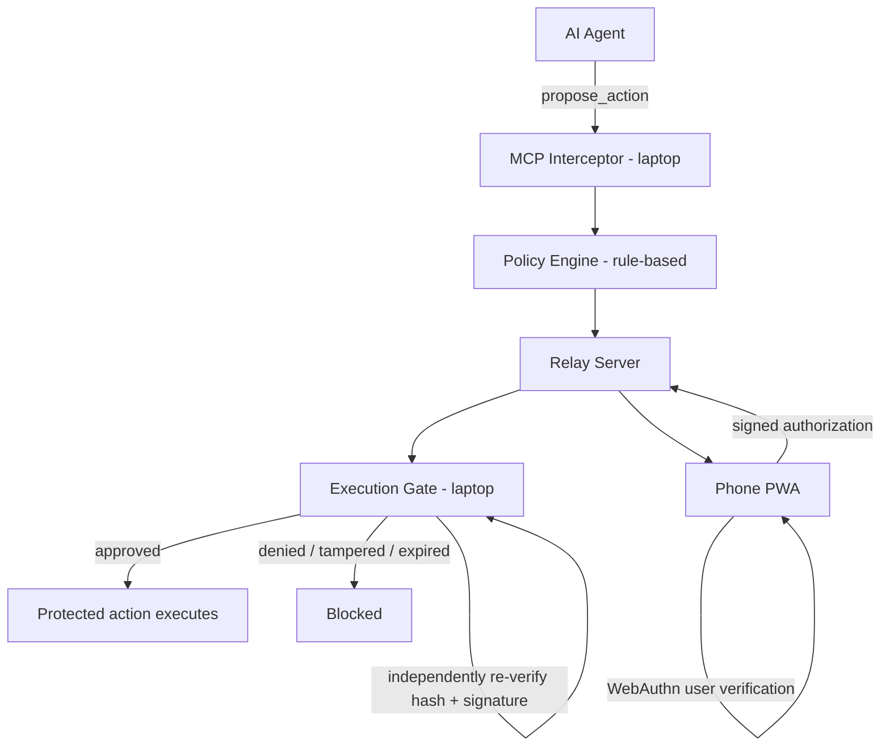

# AgentGate

An independent, phone-based human authorization layer for AI coding agents — the AI can propose an action, but only a signed, action-bound authorization from a separate device can let it execute.

## Problem

AI coding agents are moving from suggesting code to autonomously executing commands, modifying files, pushing code, accessing databases, and deploying applications. Existing agent workflows often provide confirmation prompts, but these approvals can remain inside the same environment controlled by the agent — making the human approval mechanism a weak trust boundary. Developers face a gap between giving AI the autonomy needed to work efficiently and retaining meaningful human control over high-impact actions.

## Solution

AgentGate introduces an independent, phone-based human authorization layer between an AI agent and protected execution. Risky actions are intercepted before execution, evaluated through a deterministic policy engine, and sent to the user's phone for approval. The execution gate independently verifies that the authorization corresponds to the exact requested action before allowing it to execute — keeping final authority with the human while still letting the AI reason and propose.

## Core Concept

The strongest technical property of AgentGate: the Execution Gate does not simply trust "the phone says approved." Before any action runs, it independently re-verifies:

- the exact action being executed (via a recomputed action hash)
- the authorization signature
- that the authorization has not already been used or has not expired

This action-bound, independently-verified authorization is what separates AgentGate from a same-machine confirmation dialog.

## How It Works

```
AI agent proposes an action
    ↓
AgentGate intercepts the action
    ↓
Policy engine evaluates risk (deterministic, rule-based — not AI)
    ↓
Phone receives the pending action
    ↓
Human reviews on the phone
    ↓
Human authorizes or denies
    ↓
Authorization is cryptographically bound to the exact action
    ↓
Execution Gate independently re-verifies the authorization and the action
    ↓
Execute (if valid) or block (if denied, tampered, replayed, or expired)
```

## Security Model

Authorization is built on WebAuthn: the phone holds a device-bound credential and signs a challenge only after device user verification (biometric or PIN, whichever the device provides). The signed authorization is bound to a hash of the exact proposed action, so the Execution Gate can detect if the action is swapped after approval (tamper) and reject it.

The Execution Gate — running alongside the interceptor, not on the phone — independently recomputes the action hash and re-verifies the signature itself before executing; it does not rely on a "verified" flag from any other component. A denial is also a signed, action-bound response, so it is enforced the same way an approval is, rather than being a simple UI state.

The documented trust model: **the protected execution environment exposes protected actions only through AgentGate, and the Execution Gate independently verifies the authorization before execution.** Two boundaries matter here: the phone provides the human authorization boundary — the only place a decision can be signed — and the Execution Gate provides the enforcement boundary — the only place a decision can take effect, and only after independently re-verifying the action hash and authorization. Office Kit (see below) is a development/demo workflow tool only; it is not part of the cryptographic authorization protocol. If the demonstrated setup ever grants the AI agent an access path that reaches execution without going through AgentGate's proposal path, that path is explicitly outside this trust model.

## Phone-First Hackathon Fit

This section describes the **planned** demo and build strategy from `TECHNICAL_APPROACH_V2.md`. None of it is implemented yet — see Current Status.

- **iQOO phone:** planned as the primary approval surface — pending actions, risk level, action detail, approve/deny, and WebAuthn-based user verification are all intended to happen on-device.
- **Office Kit:** per the official hackathon guide, the event alternates between Green Light (both phone and laptop usable) and Red Light (iQOO phone only, via Office Kit). AgentGate's build plan treats Office Kit — screen mirroring, clipboard, file transfer, remote control — as the intended bridge for continuing development on the laptop-hosted codebase during Red Light windows. This is a planned development workflow, not an implemented capability, and Office Kit is not part of the authorization mechanism itself.
- **Laptop:** planned to host the interceptor, policy engine, and Execution Gate — the component intended to hold actual execution permission.
- **Local/open-source AI:** planned as the first-attempted source (after a no-AI static fallback) for generating human-readable explanations of risky actions on the phone. On-device inference targeting the Snapdragon NPU is noted in the roadmap only as a stretch item, to be attempted after the core product and local-model integration are stable — not a current or guaranteed capability.
- **Creative phone use:** the roadmap's phone-as-security-console approach (live pending actions, user verification, audit history, explanations) is intended to make phone interaction a natural, functional part of the product rather than an add-on.

All of the above are build-plan intentions from the roadmap, not current functionality.

## Planned Architecture



## Planned Tech Stack

As selected in `TECHNICAL_APPROACH_V2.md` (none of this is set up yet):

- **Phone app:** PWA (React + Vite), installed to the phone home screen
- **Phone ↔ laptop communication:** Node.js + Socket.IO relay, planned to be hosted on a free tier (Render/Railway/Replit) — availability of any specific free-tier service is not guaranteed and is not an official hackathon commitment
- **Laptop interceptor:** Node.js MCP server (stdio), agent-agnostic — a preferred MCP-capable agent (e.g. Claude Code) or a CLI/manual invocation can both call the same interceptor path
- **Authentication:** WebAuthn (browser platform authenticator)
- **Local data:** SQLite, for an internal audit/attempt log
- **AI:** provider-abstracted layer, attempted only after the P0 security pipeline (see Implementation Roadmap) is complete and stable — P0: static template (no AI, zero network dependency), P1: local/open-source model attempted first, P2: Gemini free tier / official hackathon AI credits, P3: on-device Snapdragon NPU inference as a stretch item only. At every tier, AI's role is limited to producing a human-readable explanation of an action the policy engine has already classified — it never decides risk and never authorizes or denies execution. Authorization is decided by the human on the phone and independently verified by the Execution Gate, per the Security Model above.

The team's design choice is for the core product to function without requiring a paid external AI API — this is a project design decision reflected in the roadmap, not an official hackathon requirement.

## Implementation Roadmap

Full detail lives in `TECHNICAL_APPROACH_V2.md`; summary only:

- **Pre-event (current stage):** repository setup, documentation, environment setup, dependency research, planning and architecture preparation. No application/source code is written at this stage, per the official rule that submitted work must be original code written during the event window.
- **Phases 0–2 (event build window):** initial application scaffolding and phone app skeleton, created only after the official build window opens
- **Phases 3–5:** WebAuthn registration/signing, Execution Gate, action hashing and authorization binding — the core enforcement mechanism
- **Phase 6:** agent proposal path (MCP-capable agent, with an agent-agnostic CLI/manual fallback)
- **Phases 7–8:** phone ↔ laptop communication, first complete end-to-end run
- **Phases 9–10:** deny/block flow, tamper/replay/expiry/failure testing
- **Phases 11–13:** AI explanation (local model first, then Gemini/hackathon credits), phone-side Creative Phone Use features (audit/history screen, action detail view)
- **Phase 14:** Office Kit development workflow
- **Phases 15–20:** UX polish, evaluation-round preparation, pitch preparation, final demo rehearsal, submission

The roadmap defines a minimal P0 (propose → intercept → policy → phone → user verification → action-bound authorization → independent verification → execute/block → tamper rejection → deny rejection) that must be complete and stable before any AI, local model, or polish work begins.

## Current Status

**Pre-hackathon preparation. Project skeleton established. No security logic is implemented yet.**

The repository contains planning and technical documentation plus a module skeleton that establishes the directory structure and documents each component's responsibility. No application source code, prototype, or runnable security logic exists at this time. Implementation will be created during the official iQOO Hackathon 2026 build window.

## Repository Structure

```
.
├── README.md
├── ROADMAP FINAL.md
├── TEAM_EXECUTION_PLAN_FINAL.md
├── AGENTGATE_FEATURES_CURRENT_BUILD.md
├── AgentGate_Judge_Submission.md
├── .gitignore
│
├── server/                        ← laptop-side enforcement pipeline
│   ├── README.md
│   ├── policy/                    ← Deterministic Risk & Policy Engine [SKELETON]
│   │   └── README.md
│   ├── interceptor/               ← MCP Interception Layer [SKELETON]
│   │   └── README.md
│   ├── gate/                      ← Execution Gate [SKELETON]
│   │   └── README.md
│   └── relay/                     ← Relay Server [SKELETON]
│       └── README.md
│
├── phone/                         ← Phone-side PWA approval interface [SKELETON]
│   └── README.md
│
└── tests/                         ← Test suite [SKELETON]
    └── README.md
```

All `[SKELETON]` directories contain only a `README.md` documenting the module's
responsibility. No source code has been written yet.

## Getting Started

There is currently no runnable application in this repository. The skeleton
establishes module boundaries only. Setup and run instructions will be added
once implementation begins during the hackathon build window.

## Hackathon Build Strategy

During the official build window, the team will implement the roadmap in `TECHNICAL_APPROACH_V2.md` in dependency order, starting with the core enforcement path (interception, WebAuthn-based authorization, action hashing, and the Execution Gate) before any AI explanation, local model integration, or phone UI polish. Development is planned around the event's Green Light (both devices) and Red Light (phone-only, via Office Kit) structure, with feature work gated behind a working, tested core at each stage.

## Team

- Team Member 1
- Team Member 2
- Team Member 3

## License

No license has been added to this repository yet.
